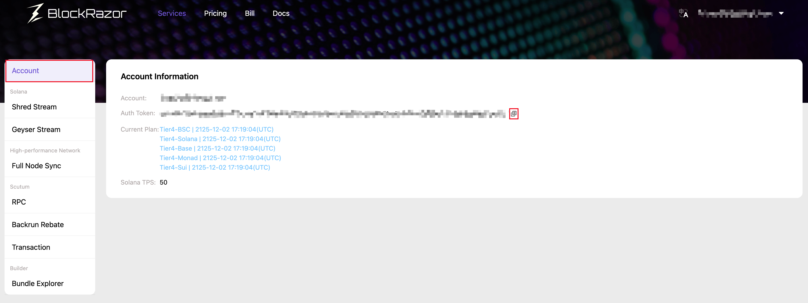

# Authentication

在對接BlockRazor服務的過程中，如需在請求中設置auth，請按如下步驟獲取：

1. 前往[https://www.blockrazor.io](https://www.blockrazor.io)，在網頁右上角點擊【註冊】，系統跳轉至註冊頁
2. 在註冊頁輸入郵箱和密碼，點擊【註冊】，系統會向郵箱發送賬戶激活郵件
3. 前往郵箱，查看賬戶激活郵件，點擊賬戶激活鏈接
4. 完成賬戶激活，前往登錄，查看賬戶信息，複製auth token

<figure><figcaption></figcaption></figure>
