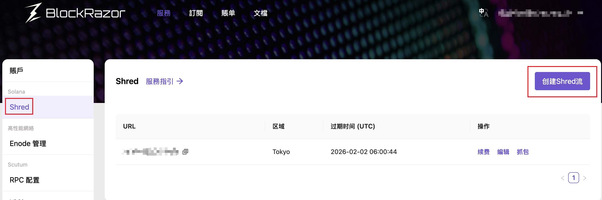
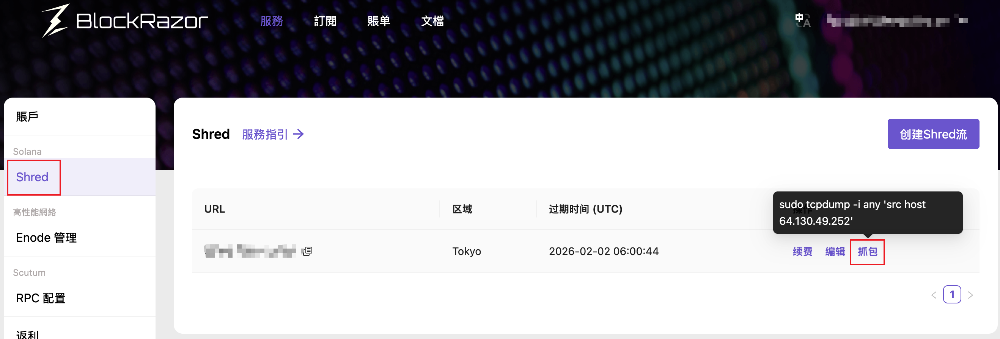

# Shred Stream

## 介紹

Shred Stream以最低延遲向Validators, RPCs, Bots, DeFi項目方等傳輸shreds.

基於全球分布式高性能網絡，Shred Stream的relay直接對接高質押量驗證者獲取shreds，通過UDP協議以最小跳數轉發shreds數據包。目前BlockRazor的Shred Relay分布於4個區域：法蘭克福、阿姆斯特丹、東京和紐約。


## 價格


订阅Tier2 - Solana及以上等级计划，可免费获得创建Shred Stream的额度


<table><thead><tr><th></th><th width="114.4609375">Tier 4</th><th width="114.4765625">Tier 3</th><th width="117.6484375">Tier 2</th><th width="120.4921875">Tier 1</th><th>Tier 0</th></tr></thead><tbody><tr><td>Shred Stream</td><td>-</td><td>-</td><td>1</td><td>2</td><td>5</td></tr></tbody></table>


Shred Stream服務可獨立採購，以下為單地區每條steam的定價。在採購完成後，你仍可在有效期內修改地區和接收shred的ip:port。


<table><thead><tr><th width="165.6875">服務週期</th><th width="194.765625">折扣</th><th>總價</th></tr></thead><tbody><tr><td>1個月</td><td>100%</td><td>$500(1 * $500)</td></tr><tr><td>3個月</td><td>95%</td><td>$1425(3 * $475)</td></tr><tr><td>6個月</td><td>90%</td><td>$2700(6 * $450)</td></tr><tr><td>9個月</td><td>85%</td><td>$3825(9 * $425)</td></tr><tr><td>12個月</td><td>80%</td><td>$4800(12 * $400)</td></tr></tbody></table>


## 使用說明

1. 前往[https://www.blockrazor.io/](https://www.blockrazor.io/)，點擊右上角的【註冊】，完成註冊
2. 登錄控制台，前往【Solana】 - 【Shred Stream】，點擊【創建Shred流】

<figure><figcaption></figcaption></figure>

3. 输入IP:Port或domain:Port，選擇距離你的服务器最近的區域


```bash
# 請確認端口已開放。如果你的服務器使用AWS等雲服務，需在雲環境中額外配置安全組（security group）的入端(inbound)規則

sudo ufw allow <port>/udp
sudo ufw reload
```


4. 選擇服務週期和支付方式，確認訂單信息
   1. 对于订阅Tier2 - Solana及以上等级计划的用户，无需执行步骤4即可直接完成创建
5. 完成支付，回到【Solana】 - 【Shred Stream】，点击【抓包】，复制抓包命令

<figure><figcaption></figcaption></figure>

6. 訪問服務器，執行抓包命令，查看Shred Stream

