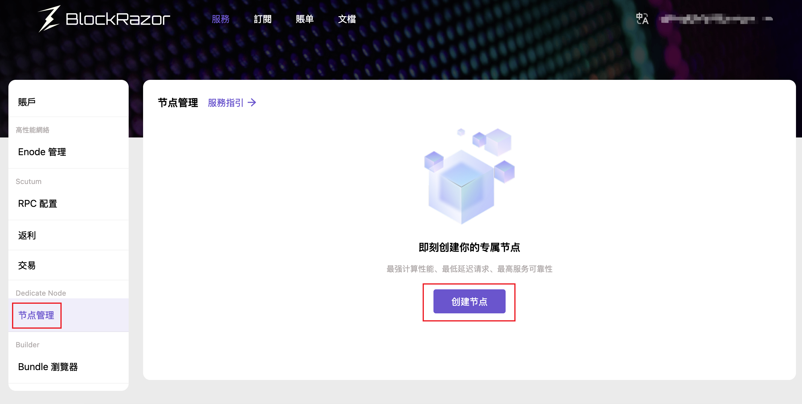
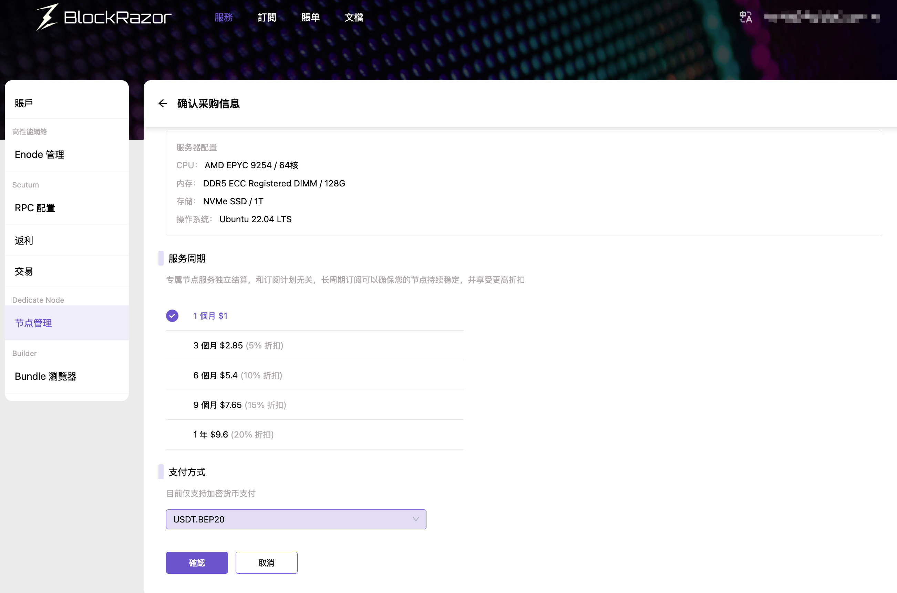
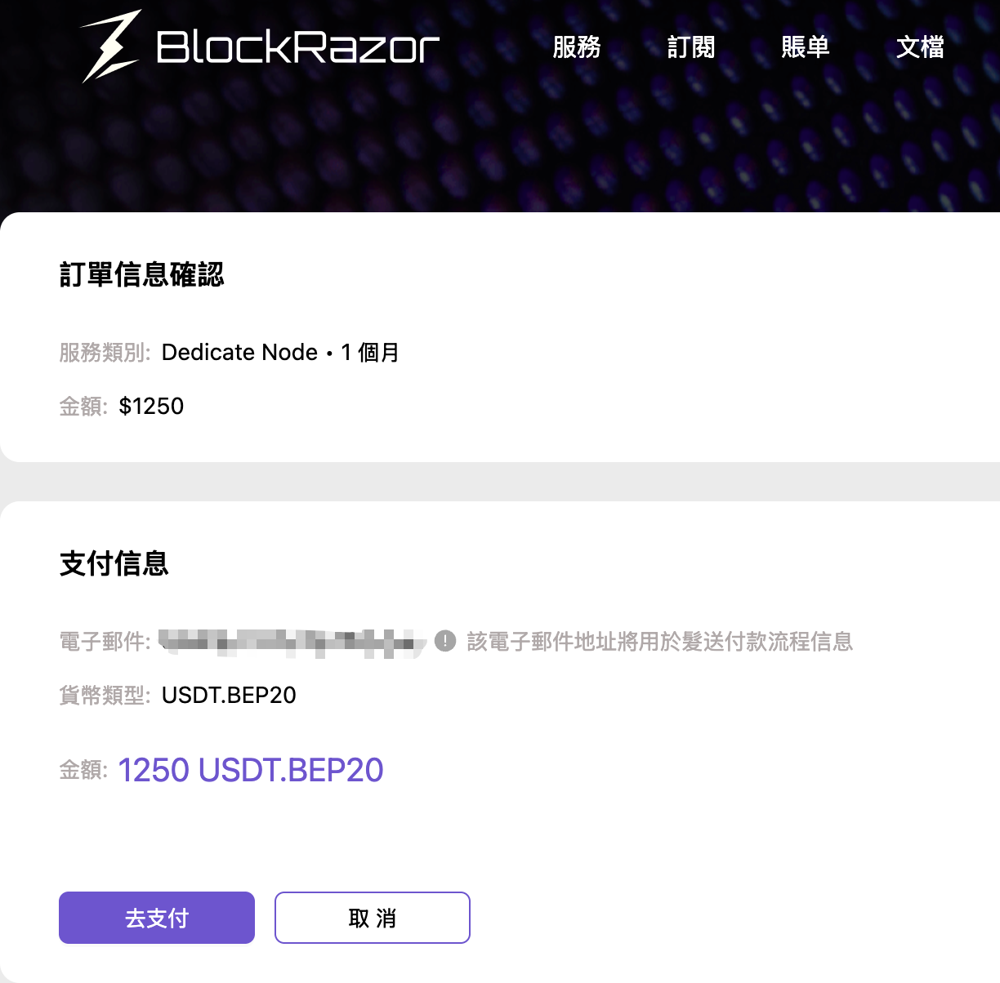

# 創建Dedicate Node



### 前往Dedicate Node

<figure><figcaption>
<a href="https://www.blockrazor.io/#/login">登录</a>控制台，点击【节点管理】 - 【创建节点】
</figcaption></figure>



### 配置Dedicate Node

<figure><figcaption></figcaption></figure>

* 節點類型：支持BSC全節點，Solana節點即將上線，敬請期待
* 區域：支持法蘭克福和弗吉尼亞2個可用區。BlockRazor會動態監測可用區資源，如資源不足則無法創建Dedicate Node，請和我們取得[聯繫](https://discord.com/invite/qqJuwRb8Nh)
* 服務器配置：根據可用區顯示相應的Dedicate Node服務器配置
* 節點客戶端：支持Geth客戶端



### 選擇服务週期和支付方式

<figure><figcaption></figcaption></figure>

目前僅支持加密貨幣支付，支持的加密貨幣為USDT.BEP20、USDT.ERC20和USDT.PRC20



### 支付加密貨幣

<figure><figcaption>
點擊【去支付】
</figcaption></figure>

<figure><figcaption>
喚起錢包或掃描二維碼完成支付
</figcaption></figure>

注意：在完成支付後，請耐心等待，系統需要幾分鐘的時間來確認您的支付，可在賬單中查看進度



### 等待節點創建完成

<figure><figcaption>
完成
</figcaption></figure>



### 使用Dedicate Node

詳見[使用Dedicate Node](shi-yong-dedicate-node.md)


