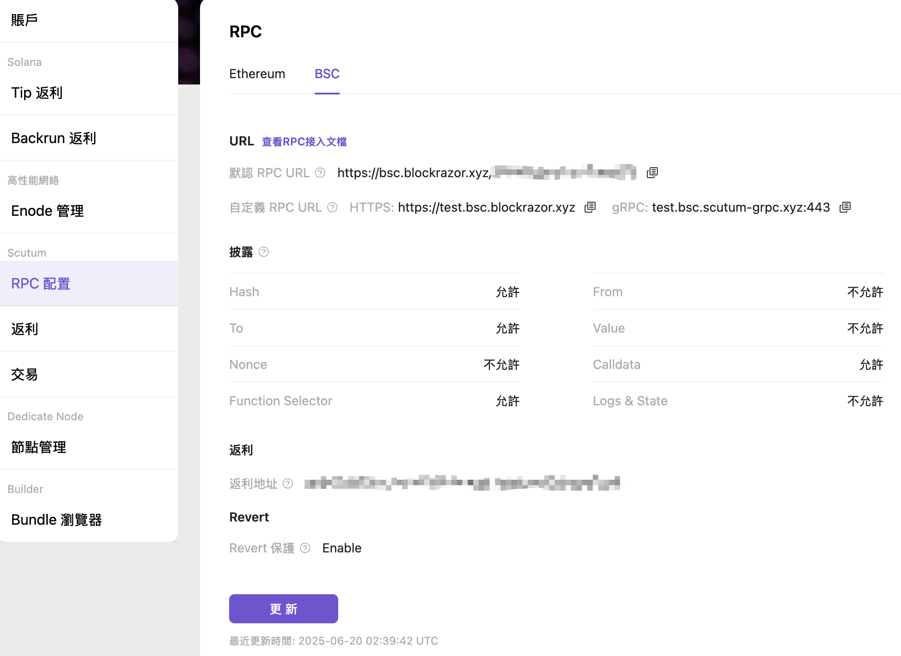

# gRPC

### 介紹

BlockRazor RPC已支持基於gRPC協議發送請求(包括標準化JSON RPC、`sendMevBundle`和`Query TxProcessStatus`) 相比HTTPS協議可降低通信延遲和計算開銷，進一步提升交易上鏈速度和競拍勝率。目前支持向BlockRazor RPC的BSC节点发送gRPC请求。


### 訂閱計劃

| Tier 4 | Tier 3 | Tier 2 | Tier 1 | Tier 0 |
| ------ | ------ | ------ | ------ | ------ |
| -      | -      | -      | ✅      | ✅      |


### 端點

gRPC端點域名獲取步驟如下：

1. [註冊](https://www.blockrazor.io/#/register)BlockRazor
2. [登錄](https://www.blockrazor.io/#/login)控制台，前往【RPC】模塊，選擇BSC，點擊【更新】

<figure><figcaption></figcaption></figure>

3. 在HTTPS URL中輸入自定義的三級域名，gRPC的三級域名會聯動更新
4. 點擊確認後更新自定義URL，複製gRPC URL


### 请求示例

```go
package main

import (
	"context"
	"crypto/tls"
	"encoding/json"
	"fmt"
	pb "github.com/easydo666/geth-grpc/rpc"
	"github.com/ethereum/go-ethereum/common"
	"github.com/ethereum/go-ethereum/common/hexutil"
	"github.com/ethereum/go-ethereum/core/types"
	"github.com/ethereum/go-ethereum/crypto"
	"google.golang.org/grpc"
	"google.golang.org/grpc/credentials"
	"log"
	"math/big"
)

var From string = "0xSomePublicAddress12439439c739036a7660ec1"
var PrivateKey string = "your from address's privateKey"
var To string = "0xSomePublicAddress12439439c739036a7660ec2"
var gRPCEndpoint string = "gRPC url" // get gRPC URL from portal

func main() {
	// 1. create a new gRPC client connection
	conn, err := grpc.NewClient(gRPCEndpoint, grpc.WithTransportCredentials(credentials.NewTLS(&tls.Config{})))
	if err != nil {
		log.Fatalf("failed to connect: %v", err)
	}
	defer conn.Close()
	client := pb.NewJsonRpcServiceClient(conn)

	// 2. construct the JSON-RPC request and obtain the nonce
	var params []string = []string{From, "pending"}
	b, _ := json.Marshal(params)

	req := &pb.JsonRpcRequest{
		Jsonrpc: "2.0",
		Method:  "eth_getTransactionCount",
		Params:  string(b),
		Id:      "1",
	}

	jsonRpc, err := client.CallJsonRpc(context.Background(), req)
	if err != nil || jsonRpc.GetError() != "" {
		if err != nil {
			fmt.Println(err)
		} else {
			fmt.Println(jsonRpc.GetError())
		}
	}
	var nonce hexutil.Uint64
	err = json.Unmarshal([]byte(jsonRpc.GetResult()), &nonce)

	// 3. construct the JSON-RPC request and send the transaction
	to := common.HexToAddress(To)
	tx := types.NewTx(&types.LegacyTx{Nonce: uint64(nonce), GasPrice: big.NewInt(1e8), Gas: 21000, To: &to, Value: big.NewInt(0)})

	privateKey, err := crypto.HexToECDSA(PrivateKey)
	if err != nil {
		log.Fatal(err)
	}
	signedTx, err := types.SignTx(tx, types.NewEIP155Signer(big.NewInt(56)), privateKey)
	if err != nil {
		log.Fatal(err)
	}
	binary, _ := signedTx.MarshalBinary()
	encode := hexutil.Encode(binary)

	b, _ = json.Marshal([]string{encode})
	req = &pb.JsonRpcRequest{
		Jsonrpc: "2.0",
		Method:  "eth_sendRawTransaction",
		Params:  string(b),
		Id:      "1",
	}

	res, err := client.CallJsonRpc(context.Background(), req)
	if err != nil || res.GetError() != "" {
		if err != nil {
			fmt.Println(err)
		} else {
			fmt.Println(res.GetError())
		}
	}
	fmt.Println(res.GetResult())
}
```


